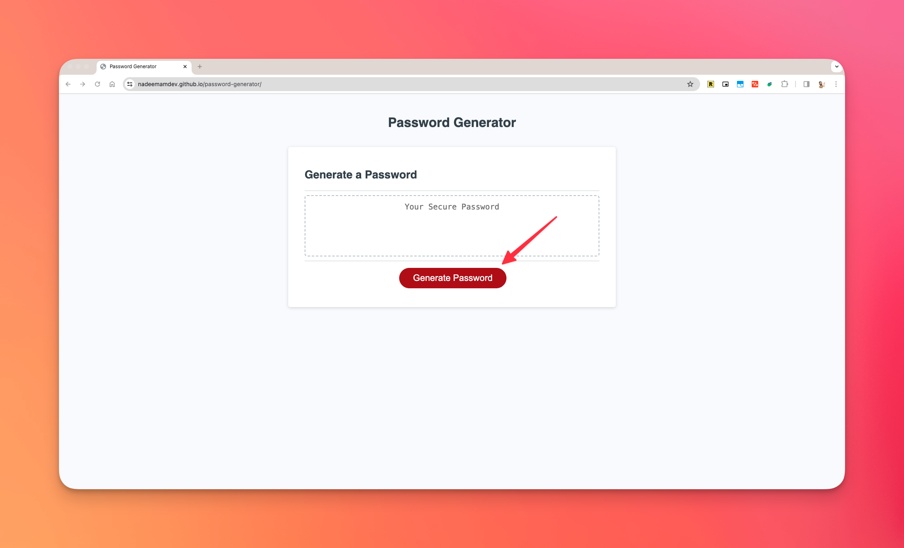
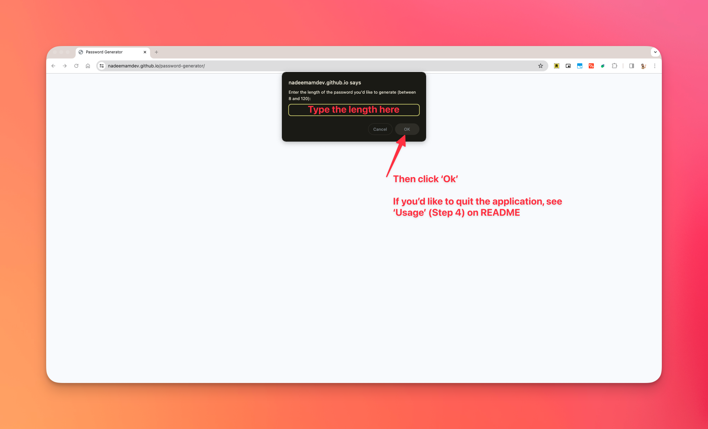
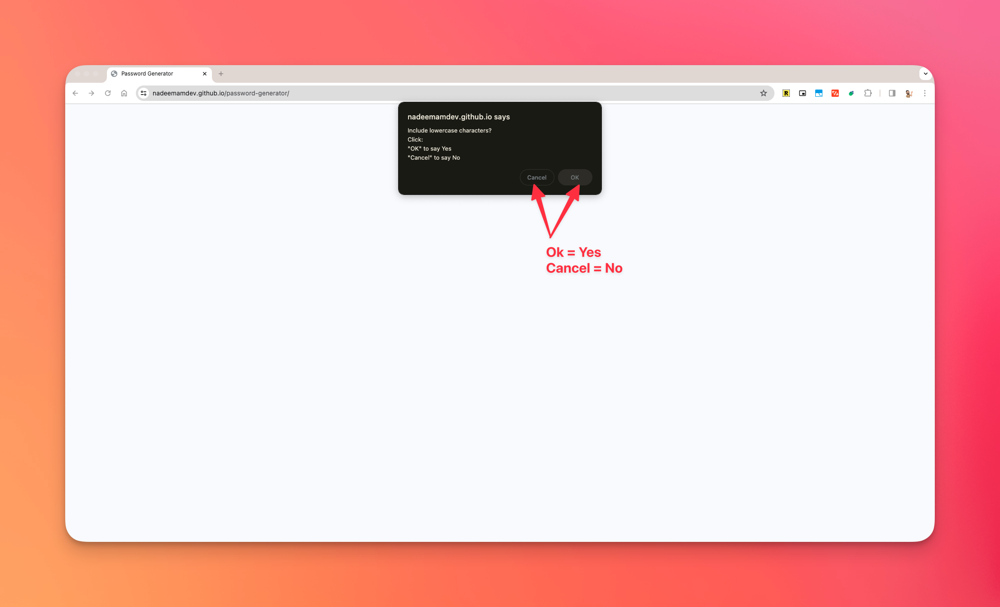
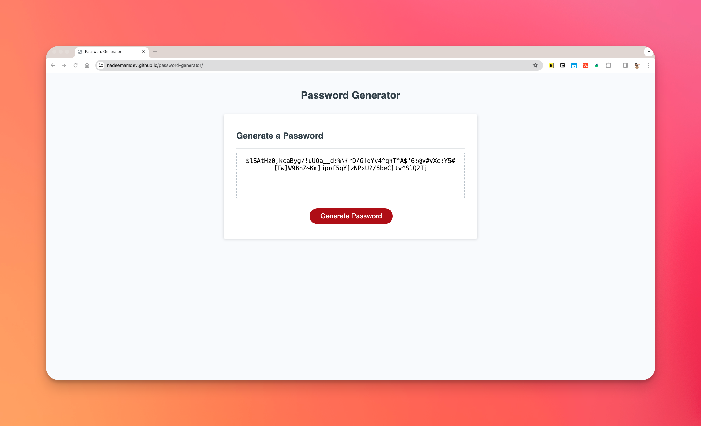

# edX Bootcamp - Module 5 Challenge

## Description

I was tasked to create an application that an employee can use to generate a random password based on criteria they’ve selected, by modifying starter code.

Note: I am currently on the Front End Web Developer course.

## Table of Contents

- [Usage](#usage)
- [License](#license)

## Usage

1. [Click this link to visit the applicaton on Github pages](https://nadeemamdev.github.io/password-generator/)

2. Click the red "Generate Password" button and follow the on-screen dialogs to generate a password that meets your requirements.

3. The password generated will display on the screen insde the box with the dashed outline.

4. To cancel/quit, close the tab which has the application loaded.

Screenshots of Live Site/Console Application:

1. The start screen

2. Example of Prompt Dialog

3. Example of Confirm Dialog (select your character type requirements)

4. Example of generated password

## License

This is a private project and therefore no License has been provided.
# password-generator
